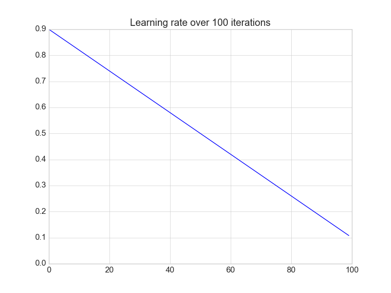
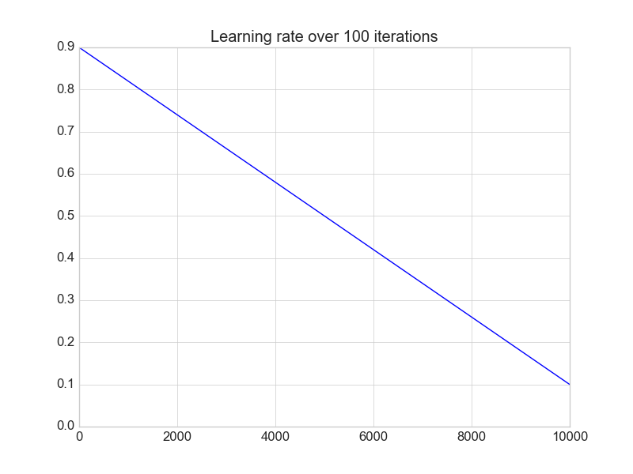

# iterative-learning-rate
A small experiment to learn how the learning rate changes over multiple iterations of a network's learning step. 

The basis of how the learning rate decays is taken from Deep Learning by Goodfellow et. al (287).

Definition of decay:

εk = (1 - α)ε0 + αετ

where:

ε0 - initial learning rate

εk - learning rate at iteration k

αετ - final learning rate

α - k/τ

### Results

#### 100 iterations

#### 1000 iterations

#### 10000 iterations
                

